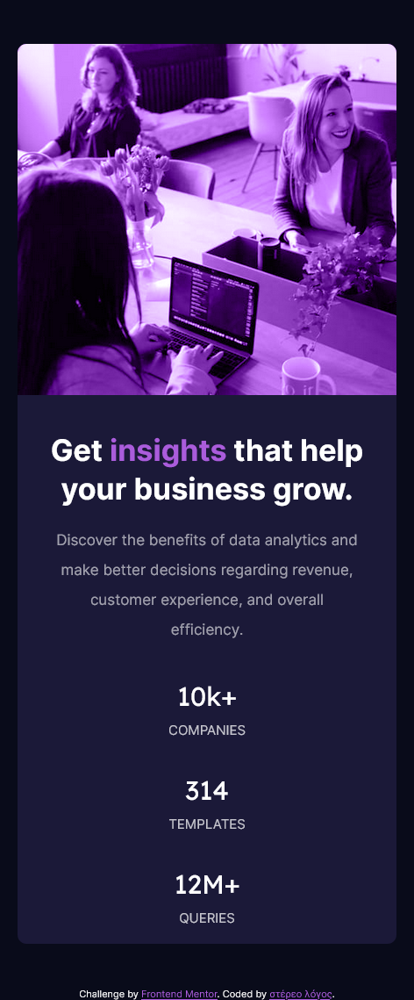

# Frontend Mentor - Stats preview card component solution
**1st challenge by stéreoslógos**

This is my solution to the [Stats preview card component challenge on Frontend Mentor](https://www.frontendmentor.io/challenges/stats-preview-card-component-8JqbgoU62).

## Table of contents

- [Overview](#overview)
  - [The challenge](#the-challenge)
  - [Screenshot](#screenshot)
  - [Links](#links)
- [My process](#my-process)
  - [Step by step](#step-by-step)
  - [What I learned](#what-i-learned)
  - [Useful resources](#useful-resources)
- [Author](#author)

## Overview

### The challenge

Users should be able to:

- View the optimal layout depending on their device's screen size

### Screenshot




### Links

- Live Site URL: [https://mystifying-elion-1283d0.netlify.app/](https://mystifying-elion-1283d0.netlify.app/)

## My process

### Step by step

- create and link a .css file to the index
- set basic resources on css:root as colors, fonts or frameworks
- organize html tags and structure
- Mobile-first workflow
- match css and html
- media query
- Desk workflow

### What I learned

I studied graphic design and did not knew css has overlay layers mode. Mind blowinq. This is also a great exercise for padding and media queries.

```html
Understading this:
```
```css
padding: 20px 200px 0 40px;
padding-left:
padding-top:
```
```
```html
:o
```
### Useful resources

- [Example resource 1](https://www.youtube.com/watch?v=2tlbKm8_4mg) - This helped me for swap ordering. Pretty much refined pn this.

## Author

- Website - [bigztar](https://bigztar.wordpress.com/)
- Frontend Mentor - [@stereoslogos](https://www.frontendmentor.io/profile/stereoslogos)
- Twitter - [@stereoslogos](https://www.twitter.com/stereoslogos)
- Instagram - [@stereoslogos](https://www.instagram.com/stereoslogos/)
